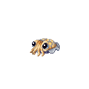
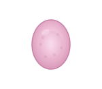
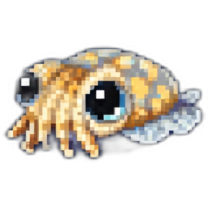
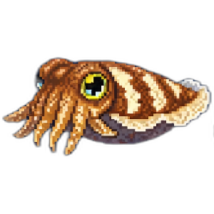
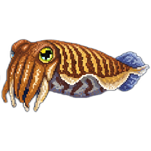
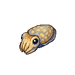
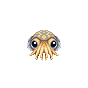
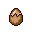

<div align="center">



# CuttleQuest

### *a charming, biology-dense cuttlefish life cycle simulator*

### **[Play it live → CuttleQuest.PhillipLavrador.com](https://CuttleQuest.PhillipLavrador.com)**

*deployed on Railway · running in production · no install required*

[](https://nextjs.org/)
[](https://www.typescriptlang.org/)
[](https://tailwindcss.com/)
[](https://firebase.google.com/)
[](https://railway.app/)

</div>

---

## What is CuttleQuest?

CuttleQuest is an educational web game that walks you through the entire life cycle of a cuttlefish — from a grape-sized egg clutch, through your first hunt as a hatchling, territorial fights as a juvenile, mating displays as an adult, and finally watching your own eggs hatch as your body slowly gives out. Each of the 12 scenes is powered by *real* cuttlefish biology: chromatophore mechanics, ballistic tentacle strikes, sneaker-male mating tactics, programmed senescence. The game is genuinely challenging and aimed at players who want to learn marine biology through their fingertips, not just watch a documentary.

> **Four life stages. Twelve scenes. One cuttlefish. No do-overs.**

<div align="center">

<table>
<tr>
<td align="center"><br/><sub><b>Egg</b></sub></td>
<td align="center"><br/><sub><b>Hatchling</b></sub></td>
<td align="center"><br/><sub><b>Juvenile</b></sub></td>
<td align="center"><br/><sub><b>Adult</b></sub></td>
</tr>
<tr>
<td align="center"><sub>fragile</sub></td>
<td align="center"><sub>tiny &amp; hungry</sub></td>
<td align="center"><sub>territorial</sub></td>
<td align="center"><sub>final form</sub></td>
</tr>
</table>

</div>

---

## What's Inside *(Developed)*



Here's what already works in the live build:

- **All 12 scenes scaffolded** across the 4 cuttlefish life stages (Egg → Hatchling → Juvenile → Adult)
- **Player profile system** — guest localStorage with optional Firebase/Firestore cloud sync (currently disabled while we tune the auth flow)
- **Interactive codex** — 11 biology encyclopedia entries that unlock as you play (passing cloud displays, W-shaped pupils, sneaker-male biology, senescence, and more)
- **Cosmetic collection + wardrobe** — unlock color/pattern/fin/mantle items through star ratings, equip them on your cuttlefish, and generate a shareable outfit card via `html2canvas`
- **Procedural chiptune audio** — SFX and music built directly on the Web Audio API, no audio assets required
- **Biology briefings + fact cards** — pre-level dossiers teach the real science, post-mechanic fact cards reinforce it
- **Star ratings, failure feedback & cosmetic drops** — every scene has 5-star criteria, biology-grounded fail explanations, and a rarity-weighted drop table
- **4-tab bottom nav** — Play, Collection, Wardrobe, and Codex

<br clear="right"/>

---

## Meet the Reef

Some of the friends and foes you'll run into across the cuttlefish's life:

<div align="center">

<table>
<tr>
<td align="center"><br/><sub><b>Egg Capsule</b><br/><i>your starting form</i></sub></td>
<td align="center"><br/><sub><b>You</b><br/><i>(eventually)</i></sub></td>
<td align="center"><br/><sub><b>Shore Crab</b><br/><i>juvenile prey</i></sub></td>
<td align="center"><br/><sub><b>Hatching</b><br/><i>almost free</i></sub></td>
</tr>
</table>

</div>

The reef is built from a mix of [Kenney.nl](https://kenney.nl/) fish-pack tiles, custom pixel-art avatars, and animated sprite sheets. See [`docs/ASSETS.md`](docs/ASSETS.md) for the full attribution list.

---

## Still Cooking *(Roadmap)*

Being honest about where things are — this is an in-progress passion project:

- **Cosmetics & avatar assets** — the cosmetic system is wired up, but the actual art assets and avatar visuals are still being designed and slotted in
- **Level polish** — right now, only **Level 2 — *Tending the Clutch*** and **Level 3 — *Breaking Free*** are fully fleshed out and playable end-to-end. All other levels are either actively being worked on or haven't been started yet

*If you're playing the live site and something feels unfinished — it probably is. Thanks for being an early visitor.*

---

## Quick Start *(Local Dev)*

```bash
# install dependencies
npm install

# start the dev server (http://localhost:3000)
npm run dev

# build for production
npm run build

# run the production server locally
npm start
```

In dev mode, new players start at **Level 1 — *Choosing the Nursery*** so you can test the full intro flow. In production, new players drop straight into **Level 2 — *Tending the Clutch***, which is the most polished scene right now.

---

## Firebase Setup *(optional)*

CuttleQuest works fully **without any credentials** — the app falls back to a local guest profile automatically. To enable Google sign-in and Firestore cloud sync, you'll need your own Firebase project and you'll need to flip `GOOGLE_AUTH_DISABLED` to `false` in [`src/lib/firebase.ts`](src/lib/firebase.ts):

1. Create a Firebase project at [console.firebase.google.com](https://console.firebase.google.com)
2. Under **Authentication → Sign-in method**, enable the **Google** provider
3. Create a Firestore database
4. Copy your Firebase config values
5. Create a `.env.local` file in the project root:

```env
NEXT_PUBLIC_FIREBASE_API_KEY=your_api_key
NEXT_PUBLIC_FIREBASE_AUTH_DOMAIN=your_project.firebaseapp.com
NEXT_PUBLIC_FIREBASE_PROJECT_ID=your_project_id
NEXT_PUBLIC_FIREBASE_STORAGE_BUCKET=your_project.appspot.com
NEXT_PUBLIC_FIREBASE_MESSAGING_SENDER_ID=your_sender_id
NEXT_PUBLIC_FIREBASE_APP_ID=your_app_id
```

See [`config/credentials.template.js`](config/credentials.template.js) for reference. Add your domain to **Authorized domains** in the Firebase console so Google sign-in actually works.

---

## Deployment

CuttleQuest is live at **[CuttleQuest.PhillipLavrador.com](https://CuttleQuest.PhillipLavrador.com)**.

The repo auto-deploys to [Railway](https://railway.app) whenever `master` gets pushed. Railway uses Nixpacks to auto-detect Next.js, runs `npm run build`, then serves the app with `npm start` (which runs `next start` in **production mode**, not dev). Firebase credentials live in the Railway dashboard environment variables — they're never committed.

[`next.config.js`](next.config.js) uses `output: 'standalone'` for a lean production bundle.

---

## Project Structure

```
CuttleQuest/
├── config/                      # credentials template
├── data/                        # all game content (editable without touching components)
│   ├── briefings.ts             # pre-level biology dossiers
│   ├── codex.ts                 # 11 interactive encyclopedia entries
│   ├── cosmetics.ts             # 120 cosmetic item definitions
│   ├── dropTable.ts             # star-to-rarity drop probabilities
│   ├── factCards.ts             # post-mechanic biology cards
│   └── sceneManifest.ts         # single source of truth for all 12 scenes
├── docs/                        # design docs, build spec, asset notes
├── public/                      # static assets (sprites, gifs, backgrounds)
└── src/
    ├── app/                     # Next.js App Router pages
    │   ├── page.tsx             # home screen
    │   ├── play/page.tsx        # game play & scene selection
    │   ├── collection/page.tsx  # cosmetics collection
    │   ├── wardrobe/page.tsx    # equip & share
    │   └── codex/page.tsx       # biology encyclopedia
    ├── components/
    │   ├── scenes/              # all 12 gameplay scene components
    │   ├── BriefingScreen.tsx   # pre-level briefing system
    │   ├── BottomNav.tsx        # 4-tab navigation
    │   ├── CuttlefishAvatar.tsx # animated cuttlefish render
    │   ├── FactCard.tsx         # slide-up biology cards
    │   ├── FailureScreen.tsx    # fail state with biology feedback
    │   ├── MuteButton.tsx       # audio toggle
    │   ├── ResultsScreen.tsx    # post-scene results & drop reveal
    │   ├── StageUpAnimation.tsx # stage transition animations
    │   └── StarRating.tsx       # star display
    ├── hooks/
    │   └── useProfile.tsx       # player profile context & state
    └── lib/
        ├── audio.ts             # Web Audio API SFX & music
        ├── firebase.ts          # Firebase init
        └── playerProfile.ts     # profile model & persistence
```

All game content lives in [`/data/`](data/) and can be edited without touching component code — biology text, star criteria, cosmetic items, drop tables, and codex entries are all data-driven.

---

## Tech Stack

- **[Next.js 14](https://nextjs.org/)** with the App Router — React framework
- **[TypeScript](https://www.typescriptlang.org/)** — type safety across data, scenes, and hooks
- **[Tailwind CSS](https://tailwindcss.com/)** — styling
- **[Firebase](https://firebase.google.com/)** — Google OAuth + Firestore cloud sync *(currently disabled)*
- **Web Audio API** — procedural chiptune SFX & music, no audio assets required
- **[html2canvas](https://html2canvas.hertzen.com/)** — shareable outfit cards from the wardrobe

---

## Game Structure

| Stage | Scenes |
|:-----:|:-------|
| **Egg** | Pick a Habitat · **Tend the Egg** ★ · **Hatch** ★ |
| **Hatchling** | First Hunt · Camouflage · Ink and Hide |
| **Juvenile** | Advanced Hunting · Territory & Ecosystem · Attract a Mate |
| **Adult** | Rival Mating Tactics · Build the Egg Nest · Tend the Eggs *(Final Exam)* |

★ = currently fully fleshed out · everything else is in progress or planned

---

<div align="center">

&nbsp;&nbsp;&nbsp;&nbsp;

*made with care and too much marine biology*

**[Play CuttleQuest →](https://CuttleQuest.PhillipLavrador.com)**

</div>